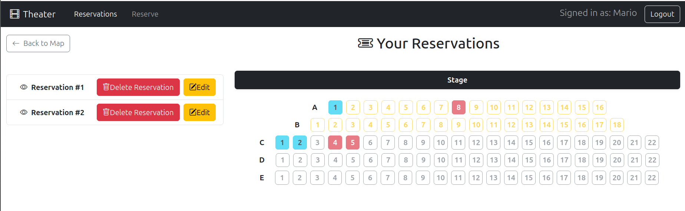

[](https://classroom.github.com/a/qm-fpFT_)
# Exam #1: "Theater"
## Student: s352452 Capitanio Letizia

## React Client Application Routes

- Route `/`: Home Page shows the map of the theater for all type of users
- Route `/reservations`: Protected route that displays the list of confirmed reservations. A standard user will see only their own reservations, while an authenticated Admin will see reservations from all users. Allows users to delete a reservation or navigate to the edit page.
- Route `/add`: Protected route for creating a new reservation. It allows users to reserve seats in two ways: by manually clicking available seats on the map, or by requesting an auto-assignment specifying the category and the number of seats.
- Route `/edit/:reservationId`: Protected route that allows a user to modify an existing reservation. Users can add or remove seats directly by interacting with the map, or request additional auto-assigned seats.
- Route `/login`: Login form, allows users to login. After a successful login, the user is redirected to the main route ("/").
- Route `*`: Page for nonexisting URLs (_Not Found_ page) that redirects to the home page.

## API Server

* POST `/api/sessions`: Authenticate and login the user.
  - **Request**: JSON object with credentials and optional admin flag:   
    ```json
    { "username": "user@test.com", "password": "password", "loginAsAdmin": false }
    ```
  - *Response body**: JSON object with the user's info (and a `required2FA` flag if logging in as admin):   
    ```json
    { "id": 1, "email": "user@test.com", "name": "Mario", "isAdmin": false, "activeAdmin": false }
    ```
  - **Codes**: `200 OK`, `401 Unauthorized` (incorrect email and/or password), `400 Bad Request`, `500 Internal Server Error`.

* POST `/api/login-totp`: Perform the 2FA through TOTP.
  - **Request**: JSON object with the TOTP code:   
    ```json
    { "code": "123456" }
    ```
  - **Response body**: JSON object with the updated user's info confirming active admin status:
    ```json
    { "id": 2, "email": "admin@test.com", "name": "Mario", "isAdmin": true, "activeAdmin": true }
    ```
  - **Codes**: `200 OK`, `401 Unauthorized` (incorrect code), `500 Internal Server Error`.

* GET `/api/sessions/current`: Get info on the logged-in user.
  - **Response body**: JSON object with the user info (same as login response).
  - **Codes**: `200 OK`, `401 Unauthorized`, `500 Internal Server Error`.

* DELETE `/api/sessions/current`: Logout the user.
  - **Response body**: Empty JSON object `{}`.
  - **Codes**: `200 OK`, `500 Internal Server Error`.


### Seats APIs

* GET `/api/seats`: Fetch all seats in the theater with their current status.
  - **Response body**: JSON array of seat objects:   
    ```json
    [
      { "rowLabel": "A", "seatNumber": 1, "category": "premium", "reservationId": null },
      { "rowLabel": "A", "seatNumber": 2, "category": "premium", "reservationId": 4 }
    ]
    ```
  - **Codes**: `200 OK`, `500 Internal Server Error`.


### Reservations APIs

* GET `/api/reservations`: Fetch all reservation IDs owned by the logged-in user (or all reservations if active admin).
  - **Response body**: JSON array of reservation IDs:   
    ```json
    [ 1, 4, 7 ]
    ```
  - **Codes**: `200 OK`, `401 Unauthorized`, `500 Internal Server Error`.

* GET `/api/reservations/:id/seats`: Fetch the list of seats associated with a specific reservation ID.
  - **Response body**: JSON array of seat objects:   
    ```json
    [
      { "rowLabel": "A", "seatNumber": 2, "category": "premium", "reservationId": 4 }
    ]
    ```
  - **Codes**: `200 OK`, `401 Unauthorized`, `403 Forbidden` (not the owner), `404 Not Found`, `422 Unprocessable Entity`, `500 Internal Server Error`.

* POST `/api/reservations`: Create a new reservation with specific seats selected on the map.
  - **Request**: JSON object with an array of seats:   
    ```json
    {
      "seats": [
        { "rowLabel": "C", "seatNumber": 5, "category": "normal" }
      ]
    }
    ```
  - **Response body**: JSON object containing success message, new reservation ID, and confirmed seats:   
    ```json
    {
      "message": "Reservation created successfully",
      "reservationId": 5,
      "seats": [ { "rowLabel": "C", "seatNumber": 5, "category": "normal", "reservationId": 5 } ]
    }
    ```
  - **Codes**: `201 Created`, `401 Unauthorized`, `403 Forbidden` (admin cannot create), `409 Conflict` (seat taken or blocked by 40s rule), `422 Unprocessable Entity`, `500 Internal Server Error`.

* POST `/api/reservations/auto`: Create a new reservation with a specified number of seats automatically assigned by the system.
  - **Request**: JSON object with category and numberOfSeats:   
    ```json
    { "category": "normal", "numberOfSeats": 3 }
    ```
  - **Response body**: JSON object containing success message, new reservation ID, and confirmed seats.
  - **Codes**: `201 Created`, `400 Bad Request` (not enough seats available), `401 Unauthorized`, `403 Forbidden`, `409 Conflict`, `422 Unprocessable Entity`, `500 Internal Server Error`.

* PUT `/api/reservations/:id`: Update a specific reservation by providing the exact desired map layout (add/remove seats).
  - **Request**: JSON object with the full array of desired seats:   
    ```json
    {
      "seats": [
        { "rowLabel": "D", "seatNumber": 1, "category": "normal" },
        { "rowLabel": "D", "seatNumber": 2, "category": "normal" }
      ]
    }
    ```
  - **Response body**: JSON object with a success message:
    ```json
    { "message": "Reservation updated successfully" }
    ```
  - **Codes**: `200 OK`, `401 Unauthorized`, `403 Forbidden`, `409 Conflict` (seat taken or blocked by 40s rule), `422 Unprocessable Entity`, `500 Internal Server Error`.

* POST `/api/reservations/:id/seats/auto`: Add auto-assigned seats to an existing reservation.
  - **Request**: JSON object with category and numberOfSeats:   
    ```json
    { "category": "premium", "numberOfSeats": 1 }
    ```
  - **Response body**: JSON object containing success message and the newly added seats.
  - **Codes**: `201 Created`, `400 Bad Request`, `401 Unauthorized`, `403 Forbidden`, `409 Conflict`, `422 Unprocessable Entity`, `500 Internal Server Error`.

* DELETE `/api/reservations/:id`: Delete a specific reservation and release all its seats.
  - **Response body**: JSON object with the number of affected rows:
    ```json
    { "numChanges": 1 }
    ```
  - **Codes**: `200 OK`, `401 Unauthorized`, `403 Forbidden`, `404 Not Found`, `422 Unprocessable Entity`, `500 Internal Server Error`.


## Database Tables

- Table `users` - _autogenerated_id_, _name_, _email_, _admin_, _hash_, _salt_, _secret_, _lastTotpStep_.
  - **admin**: boolean/integer flag (0: normal user, 1: admin user).
- Table `seats` - _row_label_ , _seat_number_, _category_, _reservation_id_.
  - **_reservation_id_**: a NULLable field referencing a reservation. If NULL, the seat is available; otherwise, it is booked.
- Table `reservations` - _reservation_id_, _user_id_. table to associate user with reservations
- Table `released_seats_log` - _autogenerated_id_, user_id_, _row_label_, _seat_number_, released_at_.
This table tracks the seats released by users to enforce the 40-second rule. 
  - **released_at**: stores the timestamp of when the seat was released to prevent the same user from re-booking it too soon.


## Main React Components

- `EditForm` (in `EditComponent.jsx`): component form to select the number of seats and the category to add to a old reservation, or new one
- `SeatMap` (in `MapComponent.jsx`): map that show the status of seats with colours. Used to add or edit a reservation
- `ReservationsList` (in `ReservationListComponent.jsx`): list to show the reservations of the user. If Admin, the list shows the reservations of all users 
- `LoginForm` (in `AuthComponent.jsx`): the login form that user can use to login into the app. This is responsible for the client-side validation of the login credentials (valid email and non-empty password).
- `TotpForm` (in `AuthComponent.jsx`): the totp form to continue the login for have access as Admin. (totp code)


## Screenshot




## Users Credentials

| email | password | name | admin |
|-------|----------|------|-------------|
| a@p.it | exam | Mario  | yes |
| b@p.it | exam | Luigi  | yes |
| l@p.it | exam | Letizia  | no |
| m@p.it | exam | Maria  | no |


